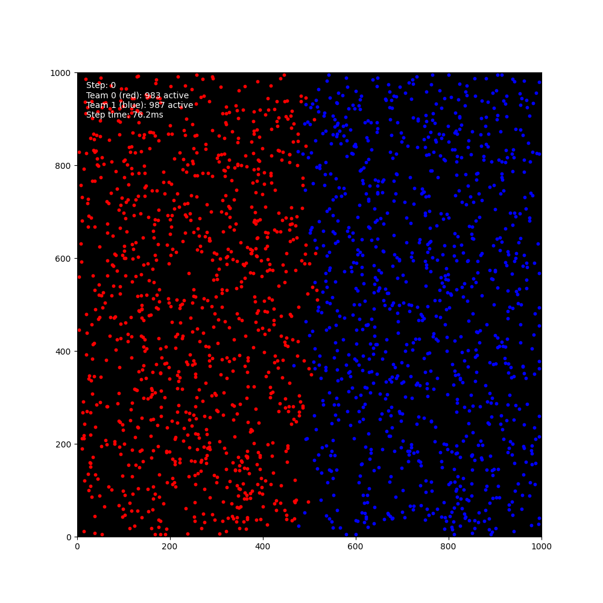

# Swarm vs Swarm Simulation

Python simulation of adversarial swarms interacting in a 2D environment. The simulation features collision detection using spatial hashing, real-time visualization, and configurable agent behaviors.



## Features

- **Efficient Collision Detection**: Uses spatial hashing for O(1) collision checks
- **Real-time Visualization**: Live visualization of agent positions and simulation state 
- **Performance Optimized**: Designed for large-scale simulations with thousands of agents
- **Configurable Parameters**: Customize world size, agent properties, and simulation settings

## Installation

1. Clone the repository:
```bash
git clone https://github.com/yourusername/swarm_on_swarm.git
cd swarm_on_swarm
```

2. Create and activate a virtual environment:
```bash
python -m venv venv
source venv/bin/activate  # On Windows: venv\Scripts\activate
```

3. Install dependencies:
```bash
pip install -r requirements.txt
```

## Usage

### Basic Usage

Run the simulation with default settings:
```bash
python -m swarm_sim.main
```

### Command Line Options

- `--steps N`: Run simulation for N steps (default: infinite)
- `--no-vis`: Disable visualization
- `--config PATH`: Load configuration from file
- `--max-velocity VALUE`: Set maximum velocity for agents
- `--time-step VALUE`: Set simulation time step in seconds
- `--save-gif PATH`: Save animation as GIF to specified path

### Example Commands

Run a 100-step simulation and save as GIF:
```bash
python -m swarm_sim.main --steps 100 --save-gif simulation.gif
```

Run with increased velocity:
```bash
python -m swarm_sim.main --max-velocity 200
```

### Python API

```python
from swarm_sim.environment import SwarmEnv
from swarm_sim.controllers import RandomController
from swarm_sim.config import SimulationConfig

# Create configuration
config = SimulationConfig(
    WORLD_SIZE=(1000.0, 1000.0),
    AGENTS_PER_TEAM=500,
    VISUALIZE=True,
    BOUNDARY_TYPE="bounce"  # Use "wrap" or "bounce"
)

# Create environment and controller
env = SwarmEnv(config)
controller = RandomController()

# Run simulation
for _ in range(1000):
    for team_id in range(config.NUM_TEAMS):
        controller.control_team(env.get_team_agents(team_id))
    env.step()
```

See `swarm_sim/examples.py` for more usage examples.

## Configuration

The simulation can be configured through the `SimulationConfig` class:

```python
config = SimulationConfig(
    # World parameters
    WORLD_SIZE=(1000.0, 1000.0),
    TIME_STEP=0.016,  # 60 FPS
    BOUNDARY_TYPE="bounce",  # "wrap" or "bounce"
    
    # Agent parameters
    AGENT_RADIUS=5.0,
    MAX_VELOCITY=100.0,
    MAX_VELOCITY_CHANGE=10.0,
    
    # Team parameters
    NUM_TEAMS=2,
    AGENTS_PER_TEAM=500,
    TEAM_COLORS=('red', 'blue'),
    
    # Visualization parameters
    FRAME_RATE=60,
    VISUALIZE=True
)
```

## Architecture

### Core Components

1. **SwarmEnv**: Main simulation environment
   - Manages agent states
   - Handles collisions
   - Provides simulation state

2. **SpatialHash**: Efficient collision detection
   - Partitions world into bins
   - O(1) collision checks
   - Automatic bin updates

3. **Agent**: Individual agent representation
   - Position and velocity
   - Team affiliation
   - Collision detection

4. **Controller**: Agent behavior control
   - Generates actions
   - Controls agent movement
   - Team-specific strategies

## Development

### Running Tests

```bash
pytest
```

### Adding New Features

1. Create new controller class in `swarm_sim/controllers/`
2. Add tests in `swarm_sim/tests/`
3. Update documentation
4. Run test suite
